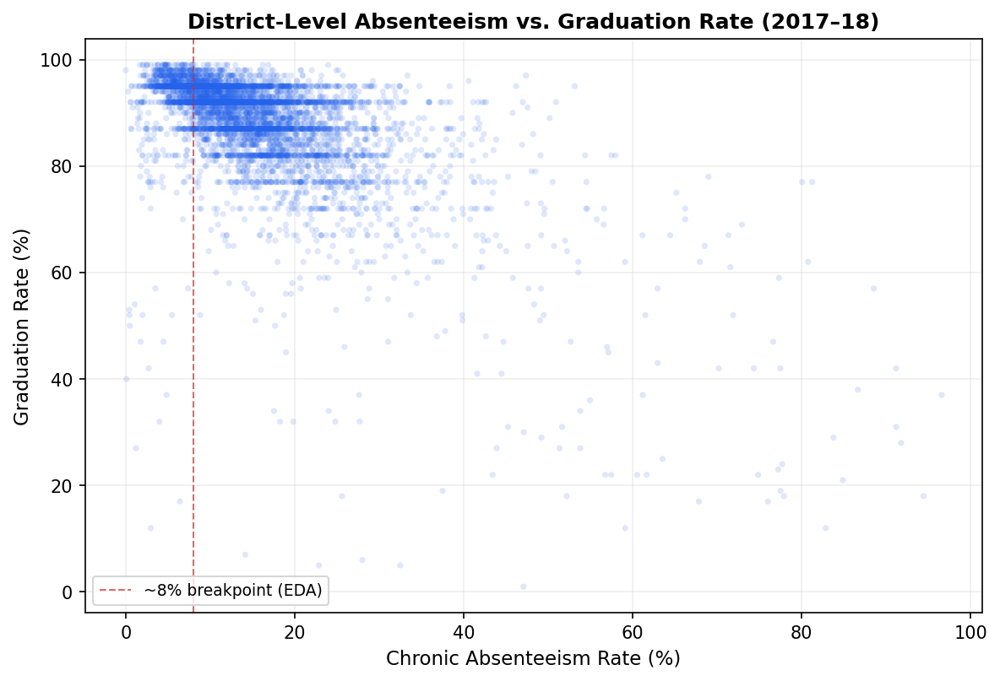
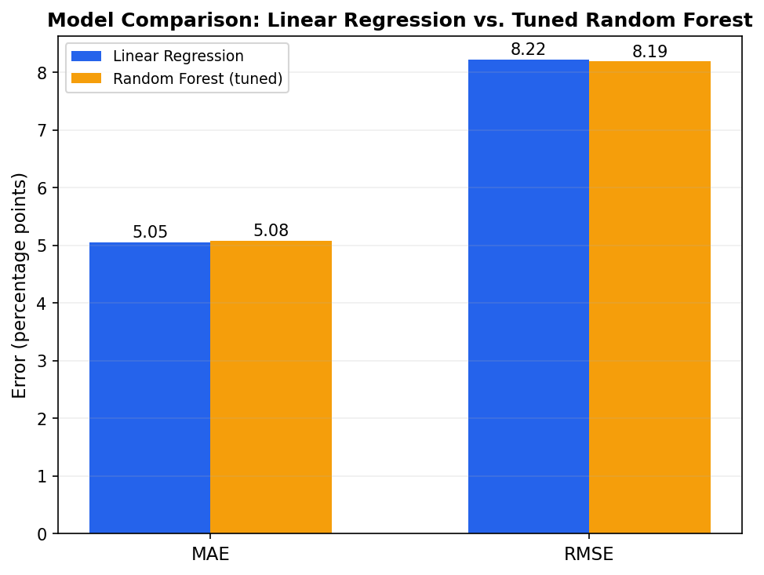

# Absenteeism–Graduation Risk Signals

Predicting district-level graduation rates from chronic absenteeism using federal education data (CRDC + EDFacts), comparing a linear regression baseline against a tuned random forest.

## Key Finding
Chronic absenteeism is a meaningful predictor of graduation rate (linear regression, R² = 0.29), but a tuned random forest offers no real improvement over the linear 
baseline (MAE 5.08 vs. 5.05, RMSE 8.19 vs. 8.22) — the added model complexity isn't justified here. Linear regression was selected as the final model for its interpretability.



## Data
- **Civil Rights Data Collection (CRDC), 2017–18** — school-level chronic absenteeism, aggregated to district (LEA) level
- **EDFacts, 2017–18** — district-level four-year adjusted cohort graduation rates
- Final analytic sample: **5,940 LEAs** with complete absenteeism and graduation data

## Approach
1. Build district-level graduation and absenteeism datasets from raw CRDC/EDFacts files
2. Join and QC the merged dataset
3. EDA and feature engineering — identified `absent_rate` as the strongest predictor (nonlinear, r = -0.60), applied a log transform to `enrolled`
4. Compare a linear regression baseline against a random forest tuned via GridSearchCV
5. Segment analysis by absenteeism level to test whether the random forest's flexibility pays off in the noisier, high-absenteeism range (it didn't — see notebook 05 for detail)



## Repository Structure
```
├── data/
│ ├── raw/ # Original CRDC and EDFacts files
│ └── processed/ # Cleaned, analysis-ready datasets
├── notebooks/
│ ├── 01_build_lea_absenteeism_v2.ipynb
│ ├── 02_build_lea_graduation_v2.ipynb
│ ├── 03_merge_and_qc_v2.ipynb
│ ├── 04_analysis_and_insights_v2.ipynb
│ └── 05_residuals_and_prioritization_v2.ipynb
└── README.md
```
## Why This Project
Built as part of a transition from K-12 teaching into data science, applying domain knowledge of school systems to a real predictive modeling problem — including honestly reporting where an initial hypothesis (random forest would outperform on noisy data) didn't hold up.
